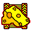
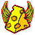

# com.pa.samzlx.cheesyicons
<h3>Strategic Cheesy icons</h3>

<a href="https://forums.uberent.com/threads/rel-client-strategic-cheesy-icons.71411/">Forum link</a>
 
This mod will replace some of your standard icons with cheese-full icons!
 
Cheese!</img>
 
<h5>Update 1.1.0:</h5>
Locust has pacman animation! (Doesn't work if another mod1 overrides shader files!)  
<h7>1. e.g. Kappa Commander icon doesn't support yet.</h7>
 
<h6>Icons (so far): </h6>
<table>
  <tr>
    <td>Commander</td>
    <td></img></td>
  </tr>
  <tr>
    <td>Atlas</td>
    <td></img></td>
  </tr>
  <tr>
    <td>Ares</td>
    <td></img></td>
  </tr>
  <tr>
    <td>Zeus</td>
    <td></img></td>
  </tr>
  <tr>
    <td>Helios</td>
    <td></img></td>
  </tr>
  <tr>
    <td>Ragnarok</td>
    <td></img></td>
  </tr>
  <tr>
    <td>Locust</td>
    <td></img></td>
  </tr>
  <tr>
    <td>Mine</td>
    <td></img></td>
  </tr>
</table>

